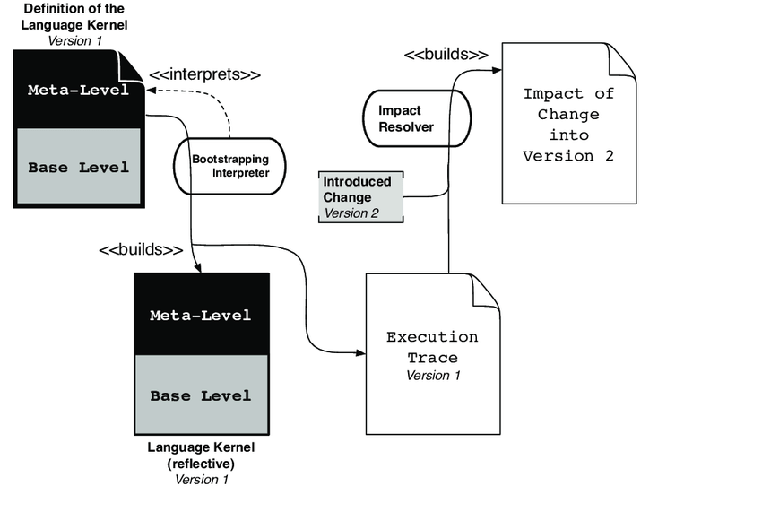
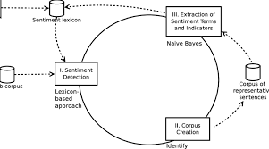
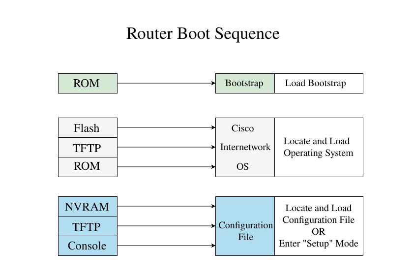

### **Bootstrap Program**

The **Bootstrap Program** is a small, essential program that is crucial for starting up a computer system. It’s also known as **firmware**, as it is often stored in **ROM** or **EEPROM** (non-volatile memory) and is executed when the computer is powered up or rebooted. This program is responsible for initializing the system and preparing it for further operations.

---

### **Key Functions of the Bootstrap Program**:

1. **Stored in ROM or EEPROM**:
   - The **bootstrap program** is typically stored in **ROM (Read-Only Memory)** or **EEPROM (Electrically Erasable Programmable Read-Only Memory)**. These are types of **non-volatile memory**, which means the program remains intact even when the system is powered off.
   - Being stored in ROM/EEPROM ensures that the bootstrap program is always available at system startup.

2. **Also Known as Firmware**:
   - The term **firmware** refers to software that is permanently programmed into hardware. The bootstrap program falls under this category because it is embedded directly into the system's hardware (ROM or EEPROM).

3. **Runs When the System Powers Up or Reboots**:
   - The **bootstrap program** is the first piece of code that runs when the system is powered up or rebooted. It operates as part of the system's **power-on self-test (POST)** process, ensuring the system hardware is functioning properly before proceeding with more complex operations.

4. **Initialization of the System**:
   - The bootstrap program is responsible for **initializing various components** of the system, such as the **CPU**, **memory**, and other hardware devices. It ensures the system is ready to run more complex tasks.
   - This initialization includes:
     - Setting up memory and the system’s hardware resources.
     - Testing the system to check if all components are working correctly.
     - Configuring system settings.

5. **Locate and Load the Operating System Kernel**:
   - The primary function of the bootstrap program is to locate the **kernel** (the core of the operating system) on the system’s storage (such as a hard drive or SSD).
   - After locating the kernel, it **loads** the kernel into the system's **main memory (RAM)**. The kernel is the essential part of the operating system responsible for managing hardware and software resources.

6. **Start Kernel Execution**:
   - Once the **kernel** is loaded into memory, the bootstrap program **hands control over** to the kernel. From this point on, the kernel takes control of the system and begins managing the system’s resources, user processes, and input/output operations.
   - After this transition, the system is ready for full operation, with the kernel running and interacting with other system software and applications.

---

### **Example of the Bootstrap Process**:

1. **Power On**: 
   - The computer is powered on or rebooted.

2. **Execute Bootstrap Program**: 
   - The CPU begins executing the code stored in ROM or EEPROM (the bootstrap program).

3. **System Initialization**: 
   - The bootstrap program initializes hardware components, such as the CPU, RAM, and peripherals.

4. **Locate the Operating System Kernel**: 
   - The bootstrap program searches for the operating system kernel in a predefined location (typically on the hard drive, SSD, or other storage device).

5. **Load the Kernel into Memory**: 
   - The bootstrap program loads the kernel into the system's **RAM**.

6. **Transfer Control to the Kernel**: 
   - The bootstrap program transfers control to the kernel, and the operating system takes over.

7. **System Ready**: 
   - The system is now fully initialized and ready to run applications and provide services to the user.

---

### **Summary**:

- The **bootstrap program** (or **firmware**) is a small program stored in **ROM** or **EEPROM** that runs when a computer is powered up or rebooted.
- Its primary functions include initializing the system’s hardware, locating the operating system kernel, loading it into memory, and handing over control to the operating system.
- This program is essential for starting up the system and making it ready for normal operations.

### **Images:**
1. 
2. 
3. 
