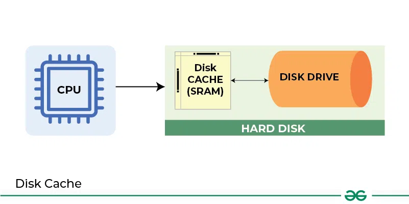

### **Caching**

Caching is a technique used in computer systems to **improve performance** by reducing the time it takes to access frequently used data or resources. Caches are smaller, **faster memory** that store copies of data that are likely to be used again soon. Caching can significantly **reduce latency** and increase the speed of data access or transfer.

---

### **Key Concepts of Caching:**

---

### 1. **Improving Access Time or Transfer Rate**

   - **Purpose of Caching**: The primary goal of caching is to improve the **access time** or **transfer rate** when data is accessed repeatedly.
     - **Access time**: The time it takes to retrieve data from memory or a storage device.
     - **Transfer rate**: The speed at which data can be moved from one place to another (e.g., from storage to memory).
   - **How It Works**: By keeping frequently accessed data in **high-speed memory** (the cache), the system can avoid slower memory or storage accesses, resulting in faster response times for repeated data requests.

   - **Example**: A CPU cache stores instructions and data that the processor is likely to need again soon, enabling faster execution compared to fetching data from the main RAM.

---

### 2. **Cache Usage and Recent Data**

   - **Recent Data Assumption**: Caching is based on the assumption that recently-accessed data will likely be needed again soon. By keeping this data in cache, the system avoids redundant and slower access to main memory or storage.
   - **Example**: When a user accesses a web page, the browser may cache parts of that page (like images) so that if the user revisits the page, those elements can be loaded quickly without having to download them again.

---

### 3. **Cache Coherency**

   - **What is Cache Coherency?**: Cache coherency ensures that multiple copies of the same data stored in different caches are kept consistent. If one cache is updated, the update must be reflected in all caches that have a copy of that data. 
   
   - **Why is it Important?**: Without cache coherency, different caches might hold outdated or conflicting versions of the same data, leading to inconsistencies and errors in the system.
   
   - **How It Works**: When data in one cache is modified, mechanisms like **cache invalidation** or **write-through protocols** ensure that all copies of the data across caches are synchronized.
     - **Example**: In a multiprocessor system, if Processor 1 updates a shared variable in its cache, cache coherency ensures that Processor 2, which may also have that variable cached, sees the updated value or invalidates its copy to retrieve the updated data from main memory.

   - **Cache Coherency Protocols**: These are rules or systems in place to maintain consistency. Some common protocols are:
     - **MESI (Modified, Exclusive, Shared, Invalid)**: A popular cache coherency protocol in multiprocessor systems.
     - **Write-through**: Every time a cache is updated, the update is also written to the main memory.
     - **Write-back**: The cache is updated, but the changes are only written to the main memory later.

---

### **Summary of Caching:**
- **Improved Performance**: Caching improves access times and transfer rates by keeping frequently used data in high-speed memory.
- **Recent Data**: Assumes recently accessed data will be needed again soon, allowing faster access to such data.
- **Cache Coherency**: Ensures that all copies of data in different caches remain consistent, avoiding data conflicts and errors.

### **Real-World Example**:
- **Web Browsers**: Caching of websites’ images, CSS, and JavaScript files helps users load previously visited sites faster by avoiding repeated downloads.
- **CPU Caching**: CPUs have multiple levels of cache (L1, L2, L3) to reduce the need to fetch data from slower RAM. When the CPU fetches data from its cache, it significantly speeds up the execution of programs.

---

In conclusion, caching is a critical optimization technique used across many components of a system to boost performance by reducing data access latency and improving efficiency.

It looks like you're looking for a visual representation of caching, including how it improves access times and the concept of cache coherency. 

Unfortunately, I can't provide a drawing directly at this moment. However, I can describe what the diagram would look like:

### **Diagram Description of Caching:**

1. **Components**:
   - **CPU**: The central processor that performs computations.
   - **Cache Memory**: A small, fast memory close to the CPU to store frequently used data.
   - **Main Memory (RAM)**: Slower than the cache but larger in size, used to store data and instructions that the CPU needs.
   - **Storage**: The hard drive or SSD, much slower than RAM, used for long-term data storage.

2. **Process Flow**:
   - **Data Transfer**:
     - The CPU first checks if the data it needs is in the **cache**.
     - If the data is not in the cache (**cache miss**), it fetches the data from **main memory** or **storage**.
     - Once the data is fetched, it’s copied to the cache, so it’s available for future use.
   
   - **Cache Coherency**:
     - When data is updated in one cache, it’s immediately reflected in other caches where the same data is stored to maintain consistency. This prevents different caches from having outdated or conflicting data.
   
### **Example Diagram**:

- **CPU** ←→ **Cache** ←→ **Main Memory** ←→ **Storage**
- Arrows demonstrate the flow of data from storage to memory to cache and back.
- A note on **Cache Coherency**: multiple caches are shown with arrows indicating synchronization of data.

If you're interested in getting a drawing or diagram based on this, you'll need to log in to ChatGPT to use the DALL-E tool. Let me know if you'd like to do that!

### **Images:**
- 
- 
- 
