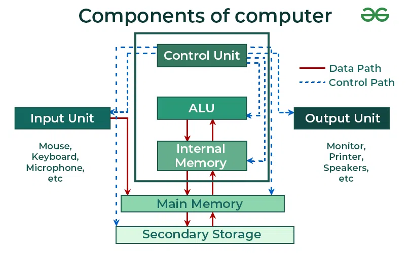

### **Computer System Components**

A computer system consists of various components that work together to perform tasks and solve problems. These components can be categorized into three main categories:

---

### **1. Hardware**
   - **Definition**: Hardware refers to the physical components of a computer system.
   - **Role**: It provides the **basic computing resources** necessary to run software and execute tasks.
   - **Examples of hardware components**:
     - **CPU (Central Processing Unit)**: The brain of the computer that performs calculations and executes instructions.
     - **Memory (RAM)**: Temporary storage that holds data and instructions currently in use.
     - **Storage Devices**: Hard drives, SSDs, CDs, and DVDs that store data permanently.
     - **Input Devices**: Devices like keyboards, mice, and touchscreens that allow users to input data into the computer.
     - **Output Devices**: Devices like monitors, printers, and speakers that allow the computer to present information to users.
     - **Peripheral Devices**: External devices like printers, scanners, and cameras that can be connected to the computer.

---

### **2. Application Programs**
   - **Definition**: Application programs are software that performs specific tasks or solves specific user problems.
   - **Role**: Application programs define **how computing resources** (such as memory, CPU, storage, etc.) are used to solve user-specific problems or execute tasks.
   - **Examples of application programs**:
     - **Word Processors**: Like Microsoft Word or Google Docs, used to create and edit text documents.
     - **Web Browsers**: Such as Google Chrome or Firefox, used to access and navigate the internet.
     - **Spreadsheets**: Like Microsoft Excel, used for organizing, analyzing, and storing data.
     - **Games**: Software for entertainment, requiring the computer to process complex graphical and computational tasks.
     - **Media Players**: Applications like VLC Media Player that allow users to view or listen to media files.

---

### **3. Operating System (OS)**
   - **Definition**: The **Operating System (OS)** is system software that manages computer hardware and software resources.
   - **Role**: The OS controls and coordinates the **hardware** and **application programs**, ensuring that resources are allocated and managed efficiently.
   - **Responsibilities of the OS**:
     - **Hardware Control**: The OS interacts directly with hardware components to manage tasks like input/output operations, memory allocation, and processor scheduling.
     - **Resource Management**: It manages system resources, such as memory, CPU time, disk space, and peripheral devices, ensuring that all running programs have access to these resources.
     - **Process Management**: The OS handles the execution of programs and ensures that different tasks or processes do not interfere with each other.
     - **User Interface**: It provides an interface (such as a command line or graphical user interface) through which users can interact with the system.
     - **File System Management**: The OS manages files and directories on storage devices, handling tasks such as file creation, deletion, reading, and writing.

---

### **Relationship Between Components**:

1. **Hardware provides the resources** (CPU, memory, storage, etc.).
2. **Application programs use these resources** to perform tasks based on user needs.
3. The **Operating System** **controls and manages the hardware**, allocating resources to the application programs and ensuring smooth operation between different components of the system.

---

### **Summary**:

- **Hardware** provides the physical resources required to run the system.
- **Application programs** define how these resources are utilized to solve specific problems or accomplish tasks for the user.
- The **Operating System** acts as an intermediary, controlling the hardware and managing its use across various application programs, ensuring efficient system performance.

Here’s a diagram illustrating the components of a computer system in the context of an operating system:

```
             +-------------------------------+
             |          Application          |
             |           Programs            |
             |  (User-level software)        |
             +-------------------------------+
                        ↑
                        |
                +-------------------+
                | Operating System   |
                |  (System software) |
                +-------------------+
                        ↑
        +------------------------+ 
        |         Hardware        |
        | (CPU, Memory, Storage,  |
        |  I/O Devices, Peripherals)|
        +------------------------+
```

### **Explanation of the Diagram**:

1. **Hardware**:
   - At the bottom of the hierarchy, **hardware** provides the basic physical resources (CPU, memory, storage, and I/O devices). It is the foundation that powers all other components of the computer system.

2. **Operating System**:
   - The **Operating System (OS)** sits in between the hardware and application programs. It acts as an intermediary layer, managing hardware resources and providing an environment for applications to run. The OS handles resource allocation, process management, and interaction with hardware.

3. **Application Programs**:
   - The **Application Programs** sit at the top level. These are the programs that users interact with directly to perform tasks, such as word processors, web browsers, or games. They rely on the OS to interact with the hardware and perform their functions.

### **Flow of Control**:
- The **Operating System** manages requests from the **Application Programs**, allocating resources from the **Hardware** as needed.

---

### **Image**:  
Here’s an illustration of the computer system components:



