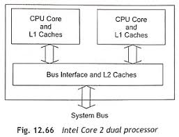

### **Dual-Core Architecture**

**Dual-core architecture** refers to processors that contain **two cores** on a single chip. Each core can process tasks independently at the same time, providing **better performance** compared to a single-core processor. Let's explore the key characteristics and benefits of this architecture.

---

### **Key Characteristics of Dual-Core Architecture:**

1. **Two Cores on a Single Chip:**
   - A dual-core processor contains **two independent processing cores** on the same chip. Each core can independently execute instructions and perform calculations.

2. **Parallel Processing:**
   - With two cores, the processor can divide tasks between the cores. In applications that support parallel processing, the dual-core processor can handle multiple tasks simultaneously, improving performance.

3. **Improved Performance Compared to Single-Core Processors:**
   - A dual-core processor can divide work between the two cores, speeding up processing. For example, tasks like web browsing while running other programs are split between the cores, enhancing overall performance.

4. **Better Multitasking:**
   - Dual-core processors excel in environments where multitasking is required, such as running **multiple applications** or **browsing the web** while simultaneously working on other tasks.

---

### **Benefits of Dual-Core Architecture:**

1. **Improved Performance:**
   - A dual-core processor delivers **higher performance** compared to a single-core processor, especially in applications that require **multitasking** or **parallel processing**. By splitting the workload across the two cores, the processor can execute tasks faster.

2. **Power Efficiency:**
   - Compared to using two separate processors, a dual-core processor is more **power-efficient**. Since the cores are on the same chip, it requires less power than systems with multiple processors across separate chips.

3. **Better Efficiency in Parallel Applications:**
   - Applications that support **parallel processing** (such as video editing software or games) can take advantage of the multiple cores to distribute the workload efficiently, resulting in a significant performance boost.

4. **Improved Multitasking:**
   - A dual-core processor can handle **multiple tasks** simultaneously with higher efficiency. For example, it can run programs in the background while the user interacts with other applications.

---

### **Applications of Dual-Core Architecture:**

1. **Mobile Devices:**
   - Smartphones and tablets rely on **dual-core processors** to achieve **improved performance** while maintaining **lower power consumption**. These processors handle multitasking and demanding apps without draining battery life.

2. **Personal Computers:**
   - Dual-core processors have become common in personal computers, where they provide good performance for multitasking and running parallel applications. They allow for smooth handling of tasks like document editing, web browsing, and media playback.

3. **Gaming:**
   - Games can benefit from dual-core processors by splitting the processing load between the cores. This improves game performance, making the experience smoother and more responsive.

4. **Streaming and Video Processing:**
   - In tasks like **video recording** or **live streaming**, dual-core processors improve video processing capabilities, providing a better experience for both content creators and viewers.

---

### **Conclusion:**

**Dual-core architecture** offers **better performance** than single-core processors, especially in **multitasking** and **parallel processing**. These processors are widely used in **mobile devices** and **personal computers**, offering **energy efficiency** and improving overall system performance. With the increasing need for processing power, dual-core architecture plays a crucial role in modern computing.

### **Images:**
1. 