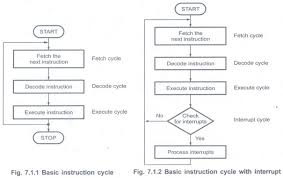
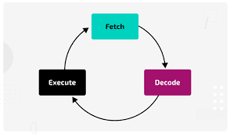
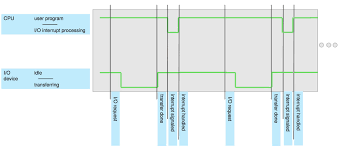
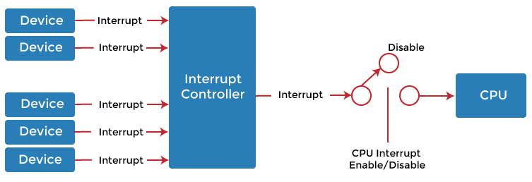
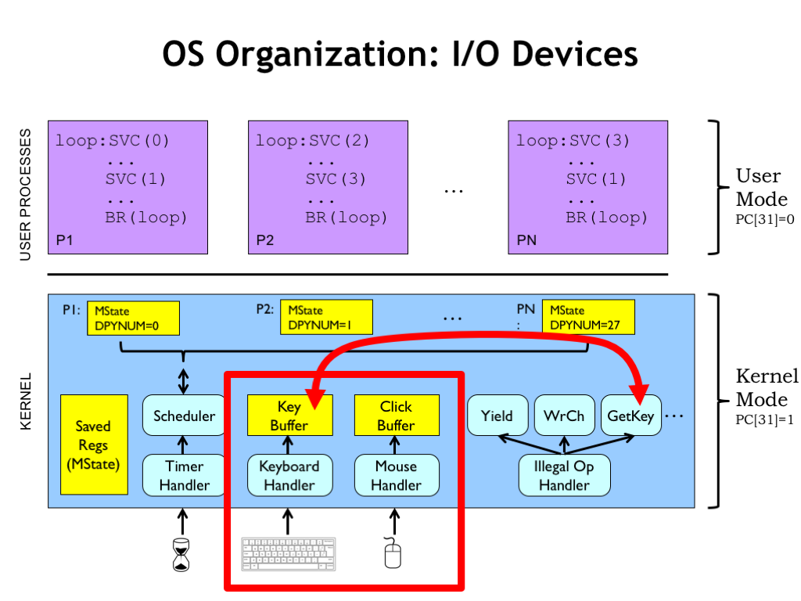

### **Interrupts in Computer Systems**

Interrupts are a critical concept in computer systems that enable the CPU to respond to events in an efficient and timely manner. Instead of continuously checking for events, the CPU can "interrupt" its current task to handle more urgent processes. Here’s an overview of the concept of interrupts:

---

### **Key Concepts of Interrupts:**

---

1. **What is an Interrupt?**
   - **Definition**: An interrupt is a signal that tells the CPU to stop its current activity and execute a different task, typically in response to an external event.
   - **Purpose**: Interrupts allow the CPU to react to important or urgent events without having to constantly check for them, improving efficiency and responsiveness.
   
---

2. **Types of Interrupts**:

   - **Hardware-Generated Interrupts**:
     - **Definition**: These interrupts are generated by hardware devices (e.g., keyboard, mouse, disk drive).
     - **How It Works**: A hardware device sends a signal to the CPU, notifying it of an event that requires attention. For example, when a key is pressed on the keyboard, the keyboard sends an interrupt to the CPU to process the input.
     - **Example**: A printer completes a task and generates an interrupt to notify the CPU that the print job is done.

   - **Software-Generated Interrupts (Traps)**:
     - **Definition**: These interrupts are triggered by software, often due to a system call or an exceptional condition in the running program.
     - **How It Works**: A system call or certain conditions (e.g., division by zero) cause the CPU to generate an interrupt. This allows the system to handle the software request or an error.
     - **Example**: A program requesting access to system resources, like memory allocation, may generate a software interrupt to invoke a system service.

---

3. **Interrupt Service Routine (ISR)**:
   - **Definition**: When an interrupt occurs, the CPU must stop what it is doing and execute a specific function, known as the **Interrupt Service Routine (ISR)** or **interrupt handler**.
   - **Purpose**: The ISR is a piece of code that handles the interrupt, performs the necessary operations, and then returns control to the CPU’s original task.
   - **Example**: When a keyboard interrupt occurs, the ISR reads the key pressed and stores the input in memory for further processing.

---

4. **Interrupt Vector**:
   - **Definition**: An interrupt vector is a table stored in low memory that holds the addresses of all the interrupt service routines.
   - **Purpose**: The interrupt vector allows the CPU to quickly find the appropriate ISR when an interrupt occurs.
   - **How It Works**: The CPU uses the interrupt vector to look up the address of the corresponding ISR, ensuring that the right handler is executed for each interrupt.
   - **Example**: If an interrupt from the keyboard occurs, the interrupt vector will point to the ISR specifically designed to handle keyboard input.

---

### **How Interrupts Work:**

1. **System Boot-up**:
   - Once the system is fully booted, it enters an idle state, waiting for events to occur (interrupts).

2. **Interrupt Occurs**:
   - **Hardware Interrupt**: A device like the keyboard or mouse generates a signal, causing the CPU to pause its current task.
   - **Software Interrupt**: A program triggers an interrupt by making a system call or encountering a condition (e.g., division by zero).

3. **Interrupt Handling**:
   - The CPU halts its current execution and looks up the interrupt vector to find the correct ISR.
   - The ISR is executed to handle the interrupt (e.g., processing keyboard input or managing system resources).
   
4. **Return to Normal Operation**:
   - After the interrupt handler completes, control is returned to the CPU to resume the previously running task.

---

### **Example of Interrupt Flow:**

1. **Interrupt Occurrence**:
   - A user presses a key on the keyboard, generating a **hardware interrupt**.
   
2. **Interrupt Vector Lookup**:
   - The CPU checks the interrupt vector to find the address of the **keyboard interrupt handler**.

3. **Execution of Interrupt Service Routine (ISR)**:
   - The **keyboard interrupt handler** is executed, which reads the key press and stores it in memory.

4. **Return to Normal Execution**:
   - Once the keyboard interrupt has been handled, the CPU resumes its original task (e.g., running a program).

---

### **Interrupt Timeline Example**

An **interrupt** is a mechanism that allows the CPU to temporarily halt its current execution in order to respond to an event (such as hardware or software signals). This mechanism helps the CPU handle asynchronous events efficiently.

Here's an **interrupt timeline example** to show how an interrupt works in a typical scenario:

---

### **Scenario:**
- The CPU is executing a program.
- A **hardware interrupt** occurs (for example, a keyboard input).
- The interrupt triggers an **interrupt service routine (ISR)** that handles the keyboard input.
- After handling the interrupt, the CPU returns to the execution of the program.

---

### **Interrupt Timeline Steps:**

1. **CPU Executes Instructions (Normal Program Flow)**
   - The CPU is executing a normal set of instructions (e.g., part of a program running in memory).
   - The **Program Counter (PC)** is pointing to the address of the current instruction to be executed.

2. **Interrupt Occurs**
   - At some point, an external event occurs (such as a key press on the keyboard) which generates an interrupt signal.
   - The interrupt can be either **hardware-generated** (e.g., from a device) or **software-generated** (e.g., a system call).

3. **Interrupt Request (IRQ) Received**
   - The CPU receives an interrupt request from the device (keyboard, for example).
   - This request signals the CPU to **pause** its current task and handle the interrupt.

4. **Saving Context (Preserving State)**
   - The CPU needs to save the current state (context) of the program it was executing (e.g., values in registers, program counter) before switching to the ISR.
   - This is important because, after the interrupt is handled, the CPU must resume from where it left off.

5. **CPU Interrupt Vector Lookup**
   - The CPU uses the **interrupt vector table** to determine the correct address of the **Interrupt Service Routine (ISR)** associated with this interrupt.
   - The interrupt vector points to the address of the handler specific to the interrupt (in this case, the keyboard input handler).

6. **Interrupt Service Routine (ISR) Executed**
   - The CPU jumps to the ISR and begins executing the interrupt handler.
   - For the keyboard interrupt, the ISR could be a routine that reads the key press and stores it in memory.
   
7. **ISR Completes Execution**
   - The ISR finishes its execution, which may include processing the interrupt, performing necessary actions, and preparing the system to resume its previous tasks.
   - The CPU may also issue a signal to the device (like the keyboard) to acknowledge that the interrupt has been processed.

8. **Restoring Context**
   - Once the ISR has completed, the CPU restores the state (context) of the interrupted program (from the saved registers, program counter, etc.).
   - This ensures that the program continues running exactly from where it was interrupted.

9. **CPU Resumes Normal Execution**
   - The CPU resumes executing the program where it left off, continuing with the next instruction.

---


### **Interrupt Timeline Diagram:**

| Time          | Event/Action                                      |
|---------------|--------------------------------------------------|
| **T0**        | CPU executes instructions (normal program flow) |
| **T1**        | Interrupt occurs (keyboard input detected)       |
| **T2**        | Interrupt request (IRQ) is received by CPU      |
| **T3**        | CPU saves context (registers, program counter)   |
| **T4**        | CPU looks up the interrupt vector table          |
| **T5**        | CPU jumps to the interrupt service routine (ISR) |
| **T6**        | ISR executes (e.g., processing the keyboard input) |
| **T7**        | ISR completes, CPU prepares to restore context  |
| **T8**        | CPU restores context (program counter, registers) |
| **T9**        | CPU resumes normal program execution            |

---
### **Diagram Overview:**
Here’s a basic sequence of how an interrupt works:

| **Step**                   | **Description**                                                |
|----------------------------|----------------------------------------------------------------|
| **1. System Running**       | CPU performs tasks normally without interruption.              |
| **2. Interrupt Occurs**     | External hardware (e.g., keyboard, timer) or software generates an interrupt signal. |
| **3. Lookup Interrupt Vector** | CPU uses the interrupt vector to find the interrupt handler address. |
| **4. Execute Interrupt Handler (ISR)** | The CPU runs the interrupt service routine (ISR) to handle the interrupt. |
| **5. Return to Normal**     | After the ISR is completed, control is returned to the previous task. |

---

### **Visual Representation:**

Below is a simplified timeline diagram to illustrate the flow:

```
+------------------------+-------------------------+---------------------+-------------------+
|                        |                         |                     |                   |
|   Normal Program Flow  | Interrupt Occurs        | Context Saved       | ISR Executed      |
|                        |                         |                     |                   |
+------------------------+-------------------------+---------------------+-------------------+
        |                          |                        |                     |
        v                          v                        v                     v
+--------------------+    +-------------------+    +---------------------+    +------------------+
| CPU Instruction 1  |    | Interrupt Occurs  |    | Save Registers & PC  |    | Execute ISR      |
+--------------------+    +-------------------+    +---------------------+    +------------------+
        |                          |                        |                     |
        |--------------------------|------------------------|---------------------|
        |                          v
        |                   Continue Program
        v
+----------------------+ 
|   Resume Program     |
+----------------------+
```

---

### **Summary:**
- **Interrupts** allow the CPU to stop executing its current program to handle important or urgent events.
- The **interrupt cycle** involves the CPU saving the state, jumping to the **ISR**, executing it, restoring the state, and continuing normal execution.
- Interrupts are a critical part of modern systems, enabling them to be responsive to external events (such as hardware signals) without constantly checking for them.

### **Images:**
- 
- 
- 
- 
- 