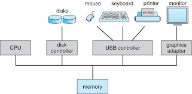

### Modern Computer System: How It Works and Its Components

A **modern computer system** is a complex network of interconnected components that work together to perform computations, process data, and provide an interface for users to interact with software and hardware. These systems have evolved significantly over the years, becoming faster, more efficient, and more versatile. Let's break down the key components of a modern computer system and how they interact.

### Key Components of a Modern Computer System:
1. **Central Processing Unit (CPU)**:
   - **Role**: The **CPU** is the "brain" of the computer. It executes instructions from programs and handles most computational tasks. It performs operations such as arithmetic, logic, and data manipulation.
   - **Components**:
     - **ALU (Arithmetic Logic Unit)**: Performs mathematical and logical operations.
     - **Control Unit (CU)**: Directs the flow of data and instructions to other parts of the computer.
     - **Registers**: Small, fast storage locations in the CPU used to store data temporarily during processing.

2. **Memory**:
   - **RAM (Random Access Memory)**: Temporary, high-speed memory used by the CPU to store data and instructions that are actively being processed.
   - **Cache Memory**: Smaller, faster memory closer to the CPU that stores frequently accessed data and instructions to speed up processing.
   - **Hard Drive/SSD (Storage)**: Non-volatile storage used to store data permanently, such as operating systems, software, and user files. SSDs (Solid-State Drives) are faster than traditional HDDs (Hard Disk Drives).

3. **Motherboard**:
   - The motherboard is the main circuit board that houses the CPU, memory, and other components like the **chipset**, **power connectors**, and expansion slots for peripherals (e.g., graphics card, network card).

4. **Input/Output Devices (I/O)**:
   - **Input Devices**: These allow users to input data into the computer, such as keyboards, mice, touchscreens, and microphones.
   - **Output Devices**: These display or produce data from the computer, such as monitors, speakers, and printers.

5. **Power Supply**:
   - Converts electrical power from an external source into usable power for the components of the computer system.

6. **Bus**:
   - A **bus** is a system of pathways used for communication between the CPU, memory, and other components. Common types include:
     - **Data Bus**: Transfers data between components.
     - **Address Bus**: Carries the addresses of data locations in memory.
     - **Control Bus**: Carries control signals to manage the operations of the computer system.

7. **Operating System (OS)**:
   - The **OS** manages the computer's hardware and software resources. It provides an interface between the user and the hardware, and ensures the execution of programs, file management, and hardware coordination.

---

### How Modern Computer Systems Work:

1. **Booting Process**:
   - When a computer is powered on, it undergoes a process called **booting**. The **BIOS/UEFI** (Basic Input/Output System or Unified Extensible Firmware Interface) performs hardware checks (POST – Power-On Self-Test), initializes the hardware components, and loads the operating system from storage into RAM.
   - The **OS kernel** is loaded into memory and starts managing the system's resources.

2. **Executing Programs**:
   - When a program is launched, the OS loads the program’s instructions into memory. The **CPU** fetches, decodes, and executes these instructions from memory. 
   - If the program needs data from storage (e.g., hard drive or SSD), the CPU sends a request to **I/O controllers**, which retrieve the data and load it into RAM for faster access.
   - During execution, the CPU may need to access other parts of memory or storage, so it continuously reads from and writes to **RAM** (temporary storage).

3. **Data Flow and Communication**:
   - **Bus** systems carry data between the CPU, memory, and I/O devices. When the CPU wants to read or write data to storage, the **address bus** carries the memory location, the **data bus** transmits the actual data, and the **control bus** sends signals to coordinate these operations.
   - **Cache memory** accelerates access to frequently used data, allowing the CPU to retrieve it quickly without waiting for slower main memory (RAM) or storage.

4. **Multitasking**:
   - Modern systems often run multiple processes concurrently. The **operating system** uses techniques like **time-sharing** and **process scheduling** to ensure that each process gets CPU time.
   - The OS handles **context switching**, where it saves the state of a running process and loads the state of another. This allows for smooth multitasking.

5. **Graphics Processing**:
   - **Graphics Processing Unit (GPU)**: Modern computers also include a GPU for tasks related to rendering images, video, and other graphical content. The GPU accelerates tasks like gaming, video editing, and deep learning, freeing up the CPU for other tasks.
   - GPUs are especially powerful for handling tasks in parallel, which is why they are also used in computational workloads (like AI or cryptocurrency mining).

6. **Networking**:
   - Computers often need to communicate with other computers or servers. This is achieved through **network interfaces** like **Wi-Fi**, **Ethernet**, or **Bluetooth**, which allow the computer to access the internet, local networks, and other devices.

---

### The Modern Computer System Diagram:

Here’s a simplified diagram illustrating the main components of a modern computer system and how they interact:

```
+-----------------------+
|    User Input         |  <-- Input devices (keyboard, mouse, etc.)
+-----------------------+
           |
           v
+-----------------------+
|     Operating System  |  <-- Manages resources, multitasking, hardware
+-----------------------+
           |
           v
+-----------------------+      +-----------------------+
|      CPU (Processor)  | <--> |    RAM (Memory)       |  <-- Stores data and instructions
+-----------------------+      +-----------------------+
           |
           v
+-----------------------+      +-----------------------+
|      Storage (SSD/HDD)| <--> |    I/O Devices        |  <-- Monitor, speakers, printer, etc.
+-----------------------+      +-----------------------+
           |
           v
+-----------------------+
|   Networking (Wi-Fi)  |  <-- Internet or local network
+-----------------------+
```

### Conclusion:
A **modern computer system** consists of various interconnected hardware components, such as the CPU, memory, storage devices, and input/output devices. It operates by loading instructions into memory, where the CPU processes them. Modern systems also use operating systems to manage multitasking, system resources, and device communication, while graphics cards and networking components handle specialized tasks like graphics rendering and internet access. These systems enable everything from basic computing tasks to complex processes like gaming, data analysis, and artificial intelligence.

### **Diagram:**
