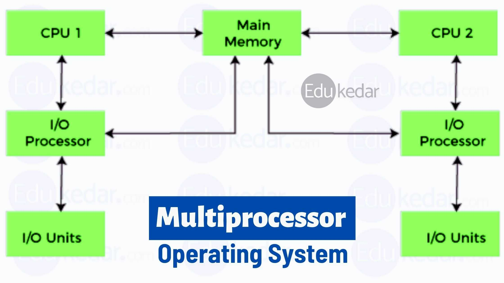
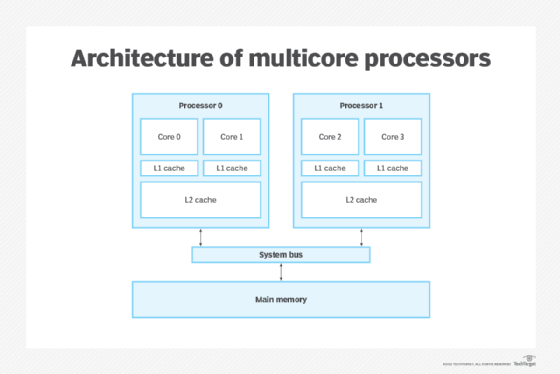
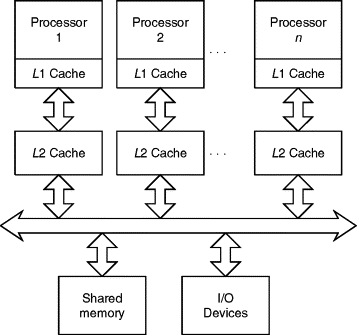

### **Multiprocessor Systems**  
Also known as **Parallel Systems** or **Tightly-Coupled Systems**, these are computer systems consisting of multiple processors working together to process data and tasks in parallel. Below are key details about these systems:

---

### **Characteristics of Multiprocessor Systems:**

1. **Presence of Multiple Processors:**
   - These systems consist of two or more processors designed to operate in parallel, processing tasks simultaneously.
   - Processors are connected through a **bus**, **shared memory**, or **system clock** for effective coordination.

2. **Communication Between Processors:**
   - Processors communicate via shared resources like **bus** or **shared memory**, facilitating smooth data exchange.
   - **Shared memory** ensures that all processors can access the same data or peripherals, enhancing efficiency.

3. **Sharing of Memory and Resources:**
   - In tightly-coupled systems, processors share **main memory** and **peripherals** such as disks or printers, allowing concurrent access to data and resources.

4. **General-Purpose Processors:**
   - These systems typically use **general-purpose processors** capable of handling a variety of computational tasks.

5. **Multiple Applications:**
   - Initially used in **servers**, multiprocessor systems are now prevalent in **mobile devices** like **smartphones** and **tablets**.
   - They are widely used for applications that require high computational power, including **big data analysis**, **machine learning**, and **gaming**.

---

### **Types of Multiprocessor Systems:**

1. **Parallel Systems:**
   - These systems use multiple processors to perform the same task or parts of it concurrently, increasing performance and reducing task completion time.
   - They rely on **instruction-level parallelism** for tasks like scientific research and artificial intelligence.

2. **Multicore Systems:**
   - **Multicore systems** feature a single processor with multiple **cores**. Each core can process data independently, improving efficiency and reducing power consumption.

3. **Distributed Systems:**
   - These systems consist of processors located in different places, communicating over networks. Unlike tightly-coupled systems, they do not share memory between processors.

---

### **Benefits of Multiprocessor Systems:**
- **Increased Performance:** Tasks are divided among multiple processors, allowing simultaneous processing of large amounts of data.
- **High Availability:** If one processor fails, others continue to work, reducing system downtime.
- **Efficiency in Handling Big Data:** Multiprocessor systems enhance parallel computing, improving the speed of big data processing.
- **Improved Speed:** Applications benefit from parallel processing, achieving faster results compared to single-processor systems.

---

### **Examples of Multiprocessor Systems:**
- **Servers in Data Centers:** Multiprocessor systems manage large databases and handle complex applications like graph analysis.
- **Mobile Devices:** Devices such as smartphones and tablets use **multicore processors** to enhance performance while reducing power consumption.
- **Video Games:** Multiprocessor systems boost game performance and provide a better user experience.

---

### **Conclusion:**
Multiprocessor systems are essential for improving performance by distributing tasks across multiple processors, working in parallel. These systems are used across diverse applications, from **servers** to **mobile devices**, delivering high computing power and exceptional performance.

---

### **Multicore Processor Systems**  
**Multicore processor systems** are a type of **multiprocessor system** that integrates **multiple processing cores** on a single chip to enhance performance and efficiency.

---

### **Characteristics of Multicore Processor Systems:**

1. **Multiple Cores on a Single Chip:**
   - **Multicore processors** integrate multiple cores into one chip, enabling parallel processing where each core handles a portion of a task.

2. **More Efficient than Multiple Single-Core Processors:**
   - Communication between cores on the same chip is faster than between processors on different chips, leading to better performance.

3. **Energy Efficiency:**
   - **Multicore processors** are more energy-efficient compared to using multiple single-core processors on separate chips, reducing power consumption.

4. **Faster Communication on the Chip:**
   - The communication speed between cores on the same chip improves system efficiency and minimizes processing delays.

5. **Multicore Systems Are Multiprocessor Systems:**
   - **Multicore systems** are a type of multiprocessor system, where multiple cores within a single chip work in parallel to process tasks.

6. **Not All Multiprocessor Systems Are Multicore:**
   - While **multicore systems** have multiple cores on a single chip, **multiprocessor systems** can have multiple single-core processors on separate chips.

---

### **Benefits of Multicore Processor Systems:**

1. **Improved Performance:**
   - Tasks can be divided among cores for faster completion. Applications that support parallel processing run significantly quicker.

2. **Increased Energy Efficiency:**
   - With multiple cores on a single chip, power consumption is reduced, leading to overall energy savings.

3. **Better Performance in Mobile Devices:**
   - **Smartphones** and **tablets** benefit from **multicore processors**, offering high performance with low energy consumption, making them ideal for gaming, multitasking, and media processing.

4. **Scalability and High Availability:**
   - Multicore systems scale easily to handle more tasks, improving performance in demanding applications.

---

### **Applications of Multicore Processor Systems:**

- **Mobile Devices:** **Smartphones** and **tablets** with multicore processors provide **high performance** with **low power consumption**, improving multitasking and gaming experiences.
- **Servers and Computational Applications:** Used in **servers** to manage heavy workloads such as database management and simultaneous processing.
- **Gaming and Animation:** Multicore processors enable faster game rendering and animations by processing tasks in parallel.
- **Scientific Applications:** Multicore systems divide complex simulations and large datasets across multiple cores, speeding up processing in scientific research.

---

### **Conclusion:**
**Multicore processor systems** offer enhanced performance, energy efficiency, and parallel processing capabilities compared to single-core systems. They are widely used in **mobile devices**, **servers**, and applications requiring high computational power.

---

### **Images:**
1. 
2. 
3. 

