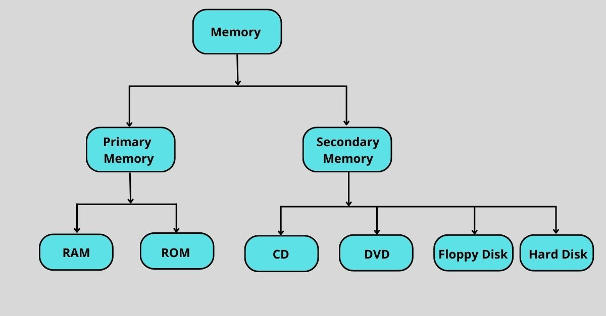
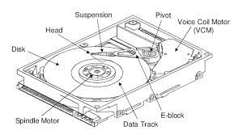

### **Secondary Storage**

In computer systems, **secondary storage** is used to store data and programs that are not currently being used in **main memory (RAM)**. Since **RAM** is usually volatile and limited in size, secondary storage is essential for providing **long-term** and **large capacity** storage.

---

### **Key Characteristics of Secondary Storage**:

1. **Non-Volatile**:
   - Unlike **RAM**, which loses its contents when the power is turned off, secondary storage is **non-volatile**. This means it retains data even when the system is powered off.

2. **Larger Capacity**:
   - **RAM** is limited in size and cannot store all programs and data needed by the system. Secondary storage devices are typically **much larger** and are used to store **large quantities** of data permanently.

3. **Slower Access**:
   - While **main memory (RAM)** is fast, secondary storage devices (such as hard drives and SSDs) are typically slower in terms of **data transfer speeds** compared to RAM.
   - However, secondary storage is **much cheaper** and can provide a **significantly larger storage capacity** than RAM.

4. **Long-Term Storage**:
   - Secondary storage serves as the **long-term storage solution**, ensuring that data and programs persist even when the computer is turned off. It is typically used to store operating systems, software applications, and user data.

---

### **Examples of Secondary Storage Devices**:

1. **Hard Disk Drive (HDD)**:
   - A **mechanical storage device** that uses spinning disks to read and write data.
   - **Advantages**: Provides large storage capacity at relatively low cost.
   - **Disadvantages**: Slower data access compared to solid-state devices.

2. **Solid-State Drive (SSD)**:
   - A **solid-state device** that uses flash memory (non-volatile memory) to store data.
   - **Advantages**: Much faster than HDDs in terms of data read/write speeds and **no moving parts**.
   - **Disadvantages**: More expensive per gigabyte compared to HDDs, though prices are dropping.

3. **Optical Discs (CDs/DVDs)**:
   - Used for storing data in the form of optical marks on a disc.
   - **Advantages**: Good for backup and archival purposes.
   - **Disadvantages**: Slow read/write speeds and smaller capacity compared to modern HDDs and SSDs.

4. **USB Flash Drives**:
   - Small, portable storage devices that use **flash memory**.
   - **Advantages**: Very portable and easy to use for transferring data.
   - **Disadvantages**: Limited capacity compared to HDDs and SSDs, and slower speeds than SSDs.

5. **Magnetic Tape**:
   - Used primarily for large-scale **backup storage** and archiving purposes.
   - **Advantages**: Extremely high capacity and cost-effective for long-term storage.
   - **Disadvantages**: Slow access times and less commonly used in everyday consumer devices.

---

### **Why is Secondary Storage Important?**

- **Memory Hierarchy**: In modern computing, data is organized across multiple levels of memory. **Primary storage (RAM)** is the fastest but limited in size, while **secondary storage** is slower but provides the necessary large capacity for storing data over the long term.
  
- **Data Persistence**: **Secondary storage** ensures that important data (such as documents, photos, applications, and system files) is not lost when the system is powered off.

- **Extends System's Capabilities**: With secondary storage, systems can handle much larger datasets than what would be possible with only RAM. It also allows for data to be loaded into RAM when needed for processing.

---

### **Data Flow Between RAM and Secondary Storage**:

1. **Loading Programs**: When you launch a program, the operating system loads the program from secondary storage (e.g., hard drive or SSD) into RAM so the CPU can execute it. 
   
2. **Storing Data**: When you're working on a file, such as a document or a photo, it's stored temporarily in **RAM** for quick access. When you save your progress, the data is transferred back to **secondary storage**.

3. **Virtual Memory**: If the system runs out of physical RAM, it uses a part of the secondary storage as **virtual memory** (usually called **paging** or **swapping**). This allows the system to continue operating by moving data between RAM and secondary storage as needed.

---

### **Diagram of Storage Hierarchy**:

```
+------------------------+
|   CPU (Registers)      |
+------------------------+
          ↑
+------------------------+
|   L1, L2, L3 Cache     |
+------------------------+
          ↑
+------------------------+
|   Main Memory (RAM)    |
+------------------------+
          ↑
+------------------------+
| Secondary Storage      |
| (HDD, SSD, etc.)       |
+------------------------+
```

---

### **Summary:**
- **Secondary storage** provides large, non-volatile storage needed for long-term data retention.
- It is slower than **main memory (RAM)** but provides much greater capacity.
- Common secondary storage devices include **HDDs**, **SSDs**, **USB drives**, and **optical discs**.
- **RAM** and **secondary storage** work together to ensure efficient data handling, with **RAM** serving as temporary, fast-access memory and **secondary storage** providing long-term data storage.

### **Images:**
1. 
2. 
3. 