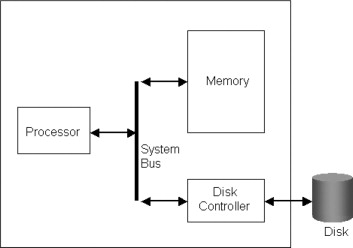

### **Single Processor Systems**

A **single-processor system** is a computing system that uses only one general-purpose processor (CPU) to execute all instructions and manage the operation of the system. These systems are often simpler and cheaper than multiprocessor systems, but they are still capable of handling a variety of computing tasks.

### Key Points:

#### 1. **General-Purpose Processors:**
   - **Definition**: A **general-purpose processor** (or CPU) is capable of executing a **complete instruction set**, meaning it can process a wide range of instructions for different types of tasks and software applications.
   - **Function**: This allows the processor to run **user processes** (applications, services, etc.), manage operating system tasks, and interact with input/output devices.
   - **Flexibility**: A general-purpose CPU can execute any software that is compatible with its architecture. For example, in a personal computer or server, the CPU runs applications like word processors, web browsers, games, and more.

#### 2. **Special-Purpose Processors:**
   - **Definition**: A **special-purpose processor** is designed to handle specific tasks and has a **limited instruction set** tailored to those tasks.
   - **Function**: Unlike general-purpose processors, special-purpose processors cannot execute user processes or run general software. Instead, they are optimized for a specific operation or device function.
   - **Examples**:
     - **Graphics Processing Unit (GPU)**: Optimized for rendering images, video processing, and parallel computations.
     - **Disk Controller**: Manages disk operations (reading/writing data) and interacts with storage devices.
     - **Keyboard Controller**: Handles the input from a keyboard and converts it into signals the system can understand.
     - **Network Interface Cards (NICs)**: Handle network communications between the computer and other devices over a network.
     - **Sound Cards**: Process audio data and provide an interface to speakers or other audio output devices.

#### 3. **Single Processor Systems:**
   - **Structure**: A single-processor system consists of one general-purpose CPU that performs all tasks, including running programs, executing instructions, and managing I/O operations.
   - **Usage**: Despite having only one processor, these systems can still use **special-purpose processors** for specific tasks (e.g., handling graphics, controlling input/output devices), but this does **not** turn the system into a multiprocessor system.
   - **Example**: A typical personal computer (PC) or laptop is a **single-processor system**, where the CPU is responsible for running the operating system and applications, while special-purpose processors (e.g., GPU for graphics) handle specific tasks.

#### 4. **Importance of Special-Purpose Processors in Single Processor Systems:**
   - **Efficiency**: Special-purpose processors offload certain tasks from the general-purpose CPU, improving system performance. For example, a GPU in a single-processor system can handle graphics rendering, freeing up the CPU for other tasks.
   - **Cost-Effective**: Instead of adding more general-purpose processors, a system can enhance functionality with special-purpose processors that focus on specific tasks.
   - **Example in Action**: In a video game, a **GPU** handles the complex graphics computations, while the **CPU** manages the game's logic, user input, and overall operations.

#### 5. **Single Processor vs. Multiprocessor Systems:**
   - **Single Processor Systems**: Only have **one general-purpose processor** (CPU). Special-purpose processors can be used, but the system does not technically become a multiprocessor system.
   - **Multiprocessor Systems**: Use **multiple general-purpose processors** (CPUs) working together, which can improve performance by distributing tasks among the processors.

### Summary:

- A **general-purpose processor** is capable of executing a broad range of tasks and programs, allowing it to manage user processes.
- **Special-purpose processors** are designed for specific tasks and cannot execute general user processes. Examples include devices such as graphics, disk controllers, and network interface cards.
- **Single-processor systems** have one general-purpose CPU and may include special-purpose processors, but they are not considered multiprocessor systems. These systems rely on a single general-purpose processor for handling most computing tasks, while special-purpose processors handle specific functions efficiently.

In short, a **single-processor system** is based around a general-purpose CPU, but **special-purpose processors** can be used to offload specific tasks like graphics or I/O management, without turning the system into a multiprocessor system.

### **Images:**
- 
