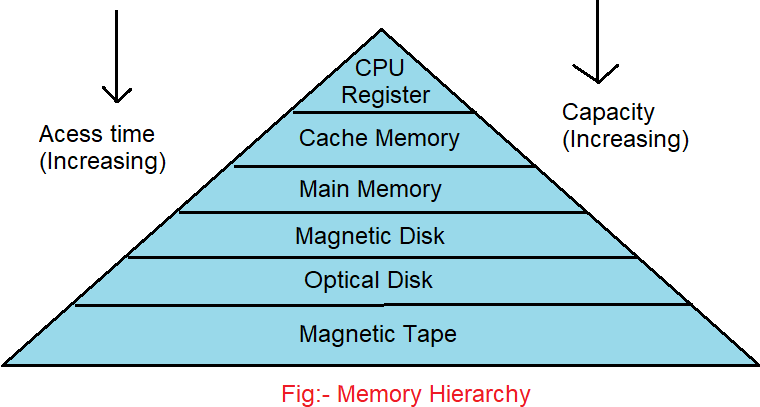
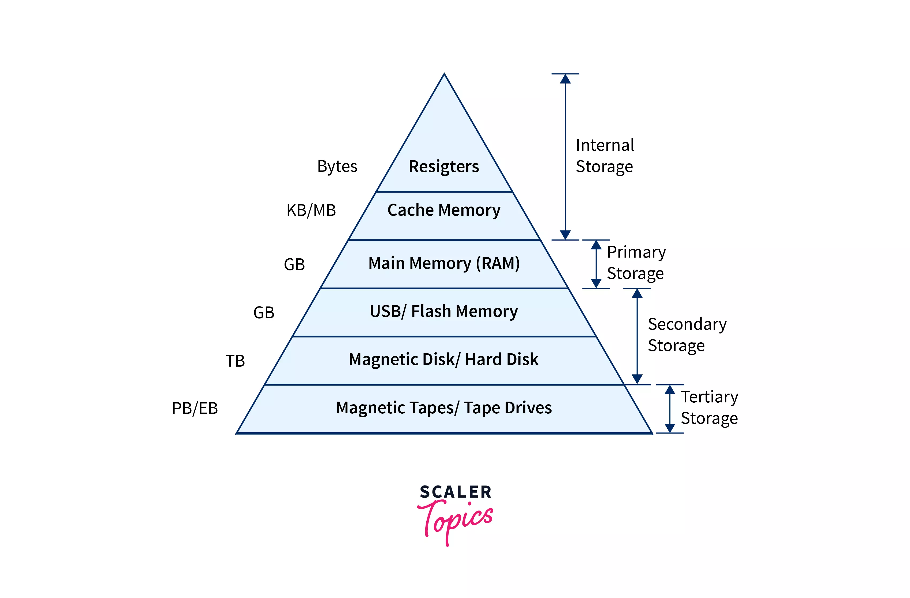
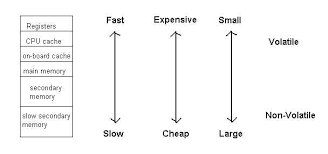
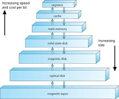

### **Storage Hierarchy**

The **storage hierarchy** in a computer system organizes different types of storage based on **speed**, **capacity**, and **cost**. It ensures that the system can efficiently manage and access data by using faster and more expensive storage for frequently accessed data, while slower and cheaper storage is used for less frequently accessed data. Here's an overview of the storage hierarchy:

---

### **Levels of the Storage Hierarchy**

1. **Registers (Fastest and Smallest)**
   - **Speed**: Fastest
   - **Capacity**: Small (only a few bytes)
   - **Cost**: High
   - **Function**: Registers are small, high-speed memory locations directly in the CPU that hold data currently being processed.
   - **Example**: Data that the CPU is actively working with during calculations.

---

2. **Cache Memory (L1, L2, L3)**
   - **Speed**: Very fast (slightly slower than registers)
   - **Capacity**: Small (a few megabytes or less)
   - **Cost**: Expensive
   - **Function**: Cache stores frequently accessed data and instructions from main memory to reduce CPU access time. Multiple levels of cache (L1, L2, and L3) are used, with L1 being the fastest and closest to the CPU.
   - **Example**: Recently accessed data and instructions for faster access during computation.

---

3. **Main Memory (RAM)**
   - **Speed**: Fast (slower than cache)
   - **Capacity**: Larger (Gigabytes)
   - **Cost**: Moderate
   - **Function**: Main memory stores the programs and data that are currently in use. When data is required that isn’t in the cache, it’s fetched from RAM.
   - **Example**: Running applications, the operating system, and open files.

---

4. **Solid-State Drives (SSD)**
   - **Speed**: Moderate (faster than HDD)
   - **Capacity**: Larger (hundreds of GBs to TBs)
   - **Cost**: Moderate to expensive (depending on capacity and technology)
   - **Function**: SSDs provide fast storage and are used to store operating systems, applications, and files that don’t fit in RAM.
   - **Example**: Storage of applications, data files, and virtual memory pages.

---

5. **Hard Disk Drives (HDD)**
   - **Speed**: Slow (slower than SSD)
   - **Capacity**: Very large (multiple TBs)
   - **Cost**: Low
   - **Function**: HDDs are used for bulk storage of data that is not actively in use but needs to be stored for long periods.
   - **Example**: Long-term storage of large files, archives, media libraries.

---

6. **Optical Storage (e.g., CDs, DVDs)**
   - **Speed**: Slow
   - **Capacity**: Medium (up to a few GBs)
   - **Cost**: Low
   - **Function**: Optical media is used for archival storage or distribution of data that is rarely accessed.
   - **Example**: Storing movies, software distribution, and backups.

---

7. **Magnetic Tapes (Slowest and Cheapest)**
   - **Speed**: Slowest
   - **Capacity**: Very large (multiple TBs)
   - **Cost**: Very low
   - **Function**: Magnetic tapes are typically used for **backup** and **archival** purposes. They are not for regular use but provide a cost-effective solution for storing large amounts of data for the long term.
   - **Example**: Archival backup for large organizations or data centers.

---

### **Storage Hierarchy Overview**

| Level               | Speed            | Capacity       | Cost            | Example                                           |
|---------------------|------------------|----------------|-----------------|---------------------------------------------------|
| **Registers**        | Fastest          | Small          | Expensive       | Data currently being processed by CPU            |
| **Cache Memory (L1, L2, L3)** | Very Fast      | Small          | Expensive       | Frequently accessed data and instructions        |
| **Main Memory (RAM)**| Fast             | Large (GB)     | Moderate        | Running programs and data in active use          |
| **Solid-State Drives (SSD)** | Moderate        | Large (GB to TB) | Moderate to Expensive | Storage of active data and programs             |
| **Hard Disk Drives (HDD)** | Slow             | Very Large (TB) | Low             | Long-term storage of large files and data        |
| **Optical Storage**  | Slow             | Medium (GB)    | Low             | Archival or distribution of rarely accessed data |
| **Magnetic Tapes**   | Slowest          | Very Large (TB) | Very Low        | Backup and archival storage                      |

---

### **Key Concepts in Storage Hierarchy**

- **Data Locality**: The principle that the closer the storage is to the CPU (e.g., registers, cache), the faster the data can be accessed. As you go further down the hierarchy (RAM, HDD, etc.), access times increase.
- **Cost vs. Performance Trade-Off**: Faster storage is typically more expensive (registers, cache), while slower storage offers larger capacity at a lower cost (HDD, magnetic tapes).
- **Caching and Virtual Memory**: The use of faster storage layers (cache) to hold copies of frequently accessed data, improving performance. Additionally, **virtual memory** allows storage devices (like SSDs and HDDs) to act as if they were RAM, even though they are slower.

---

### **Summary**

The storage hierarchy is designed to balance **performance** and **cost** by using a combination of fast, small, and expensive storage (like registers and cache) for quick access, and large, slower, and cheaper storage (like HDDs and tapes) for long-term data storage. By employing multiple levels of storage, the system can efficiently handle both immediate and archival data needs.

---

### **Storage Structure in Computer Systems**

In a computer system, different types of memory are used to store data and instructions. Each type of memory has its own characteristics such as **mutability** (whether it can be changed), **speed**, and **capacity**. Below is an overview of various memory types and how they interact with the **CPU**.

---

### **Types of Memory**

1. **ROM (Read-Only Memory)**:
   - **Description**: ROM is a type of non-volatile memory that **cannot be changed** after it is written during the manufacturing process.
   - **Purpose**: ROM is typically used to store firmware or system-level software that doesn't need to change frequently, like the **BIOS** or **bootloader**.
   - **Characteristics**: 
     - **Non-volatile**: Data is retained even when the system is powered off.
     - **Read-only**: Data can be read but not written to during normal operations.

2. **EEPROM (Electrically Erasable Programmable Read-Only Memory)**:
   - **Description**: EEPROM is also non-volatile, but it **can be changed** electronically (though not frequently).
   - **Purpose**: EEPROM is used in applications where data needs to be updated occasionally, such as in storing configuration settings or small amounts of data that need to be preserved after power is turned off.
   - **Characteristics**: 
     - **Non-volatile**.
     - **Writable**: Can be rewritten, but typically requires more time and fewer write cycles compared to other memory types like RAM.

3. **Main Memory (RAM)**:
   - **Description**: RAM (Random Access Memory) is the primary volatile memory used by the CPU during program execution. The most common type of RAM used today is **DRAM** (Dynamic RAM).
   - **Purpose**: It is used to store both **data** and **instructions** that are being actively used or processed by the CPU.
   - **Characteristics**:
     - **Volatile**: Data is lost when power is turned off.
     - **Dynamic**: Requires periodic refreshing to maintain data, which is why it’s called **DRAM**.
     - **Writable**: Can be read and written by the CPU.

---

### **CPU and Memory Interaction**

1. **Fetching Instructions**:
   - The **CPU** can only load instructions from **main memory (RAM)**.
   - When executing a program, the CPU fetches instructions from RAM, decodes them, and executes them. The instructions may require data to be fetched from memory or stored back into memory.

2. **Load and Store Instructions**:
   - **Load**: The **load instruction** moves a word (a fixed-sized chunk of data) from **RAM** into a **CPU register**. 
     - **Example**: `Load R1, 0x1000` means load the data at memory address `0x1000` into the CPU register `R1`.
   - **Store**: The **store instruction** moves the contents of a **CPU register** into **RAM**.
     - **Example**: `Store R1, 0x1000` means store the contents of register `R1` into the memory location at address `0x1000`.

---

### **Diagram of Memory Interaction**:

Here’s a simple diagram of how the CPU interacts with memory:

```
 +-------------------+
 |                   |
 |      CPU          |
 |                   |
 |  +-------------+  |    Load  (moves data from RAM to register)
 |  |  Register   |  | <-------------------------------+
 |  +-------------+  |                                 |
 +-------------------+                                 |
        |                                              |
        |                                              |
        V                                              V
 +-------------------+     Store (moves data from register to RAM)
 |                   | ---------------------------->  |
 |    Main Memory    |                               |
 |      (RAM)        | <-----------------------------+
 |                   |
 +-------------------+
```

---

### **Key Points to Remember:**

- **ROM**: Cannot be changed and stores permanent instructions or data (e.g., BIOS).
- **EEPROM**: Can be changed but not frequently; useful for configuration data.
- **RAM (DRAM)**: The CPU’s working memory, where programs and data are actively used. It is **volatile**, meaning it loses data when power is turned off.
- **Load and Store Instructions**:
  - **Load** moves data from RAM to a register in the CPU.
  - **Store** moves data from the CPU register back into RAM.

By using load and store instructions, the CPU can manipulate data stored in RAM, which allows it to perform various operations such as calculations, data retrieval, and data storage.

---

### **Images:**
- 
- 
- 
- 
- 